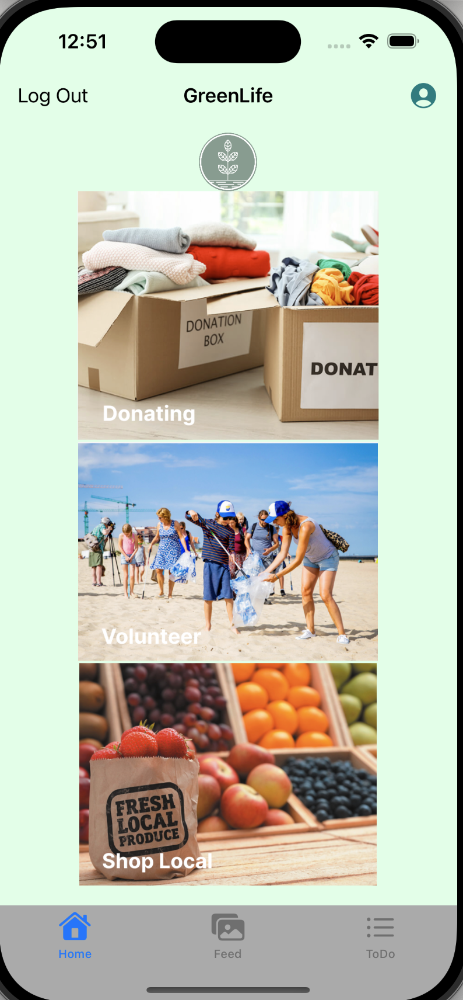

# CodePath-iOS102-GroupProject

## Name of the App : GreenLife

## Table of Contents
1. [Overview](#Overview)
2. [Product Spec](#Product-Spec)

## Overview
### Description
GreenLife is an app that encourages sustainability in everyday life and helps reduce our carbon footprint, one user at a time. 
The user can sign up and create an account.
As the user logs in, the app takes him/her to the hompage. Here the user can see three user stories : 

- Donate Clothing : Pressing on this image takes the user to clothing donation user story. There are some interesting facts presented to the user on this page plus the option to search for nearby clothing donation centers using  entered zipcode.
- Volunteering : Pressing on this image takes the user to volunteering user story. There are some interesting facts presented to the user on this page plus the option to add a volunteering task to to-do list.
- Shop locally : Pressing on this image takes the user to shop locally user story. There are some interesting facts presented to the user on this page plus the option to search for nearby local businesses using the relevant terms and zipcode.

### App Evaluation
- **Category:** LifeStyle
- **Mobile:** This app would be primarily developed for mobile but would perhaps be just as viable on a computer. Functionality wouldn't be limited to mobile devices, however mobile version could potentially have more features.
- **Story:** 
   - Connected API (Yelp) which shows the location of clothing donation drop-offs, and local businesses. In future iterations we will add more APIs to take the user to nearby recycling centers, volunteer opportunities, etc.
   - List (scroll page) : with descriptions of alternative, eco-friendly actions and greener activities. 
   - A media feed: allows users to post their current eco-friendly efforts and inspires others to follow in their footsteps.
   - To Do List: allows users to keep track of their eco-friendly goals in an orderly fashion in the app, including add a photo with location to confirm the task has been completed.
   - Profile: user can add their information into their profile page including an image from their camera roll or take a photo. In future iterations we would like to connect their profile picture to the feed page.
- **Market:** Any individual could choose to use this app. We are hoping to inspire environmental activism and encourage sustainable living for a greener future. 
- **Habit:** This app could be used as often or unoften as the user wanted depending on when the user needs to do such activities.
- **Scope:** Since this app serves the needs of an individual it can work with any number of users.

## Product Spec
### 1. User Stories (Required and Optional)

**Required Must-have Stories**

* User can sig ups to create a new account.
* User can log in to access previous green efforts 
* User can pick the story/feature she/he wants to use.
* User can add more personal information in profile page.
* User can see social media style "post feed" to connect with other users. But first she/he needs to share a post so others' posts can become visible.
* User can add a To-Do List.

**Optional Nice-to-have Stories**
* API connected to donation centers, local shops, volunteer opportunities, recycling centers, and more
* Log of past activities in to-do list

### 2. Screen Archetypes

* Launch Screen
* Login
  * User enters the username and password to login to the system
* Register
  * New user can sign up with an email, new username and password to the application
* GreenLife activities screen
  * Users can tap into an image related to an action 
  * The user is navigated to a new screen which displays some facts and tips related to the action and options to do a search (for clothing donation centers and local shops) or add a task to to-do list(for volunteering)
* Feed
  * Users can view posts made by others and themselves (probabily posts made within a specific location range)
  * Users can share photos from the post screen
* Profile screen
  * User can view their profile (and in future iterations, the profile of others and view the posts that they made)
* Search results
  * Show nearby locations of donation centers or local shops
* To Do List
  * Users can add items that they want to do
  * User can pull down the view to refresh the screen and see newly added tasks.
  * User can mark a task complete by attaching a photo
  * Includes a map to show location of the completed task

### 3. Navigation

**Tab Navigation** (Tab to Screen)
  * Home (GreenLife Activities)
  * Post Feed
  * To Do List  

**Flow Navigation** (Screen to Screen)

* Signup -> Account creation 
* Login -> Home (Activity Selection) Screen
* Activity Selection Screen -> Facts and Tips Screen
* If tapped on clothing donation image  -> read the facts and search by zipcode -> go to the screen where a list of donation centers are shown.
* If tapped on volunteering image -> read the facts and add a volunteering task -> go to the to-do list screen.
* If tapped on shop locally image -> read the facts and search for a local business with a search term and zipcode -> go to the screen where a list of local shops are shown.
* Profile button on Home screen -> User's Profile
* Post button on Feed Screen -> create a new post screen
* Add button (+) on To-Do List screen -> add a new task screen
* Pull to refresh the newly added task
* Tap on a task to go to the task's detail page 
* Future iteration: Settings -> Toggle settings (Optional)

### Video Walkthrough
https://www.loom.com/share/4e8013d4b46f43249f1ff29a547be95f?t=3

### Screen shot of the Homepage

 

## Schema 

### Models

- User
- Post
- Task

### Networking

- Parse Network request:
    - User login screen : `User.login(username: username, password: password)`
    - User signup screen : `newUser.signup()`
    -  Profile screen : `imageDataRequest = AF.request(imageUrl).responseImage()`
    -  To-Do list screen : `Task.query("username" == User.current?.username)
            .order([.descending("createdAt")])`
    - Create a new task screen : `task.save()`
    - Task detail screen : `task.save()`
     
- Yelp API end points: 
  - Clothing Donation Center Screen : https://api.yelp.com/v3/businesses/search?location=\(zipcode!)&term=clothing%20donation&sort_by=best_match&limit=20
  - Yelp API: Local Businesses Screen : https://api.yelp.com/v3/businesses/search?location=\(zipCode!)&term=\(searchTerm!)&sort_by=best_match&limit=20

